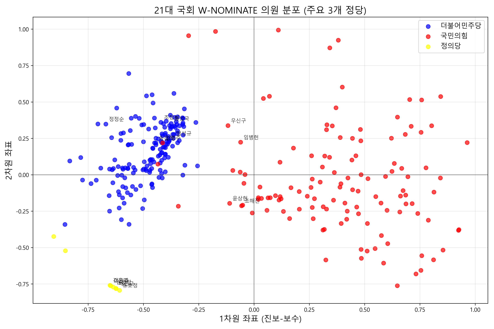
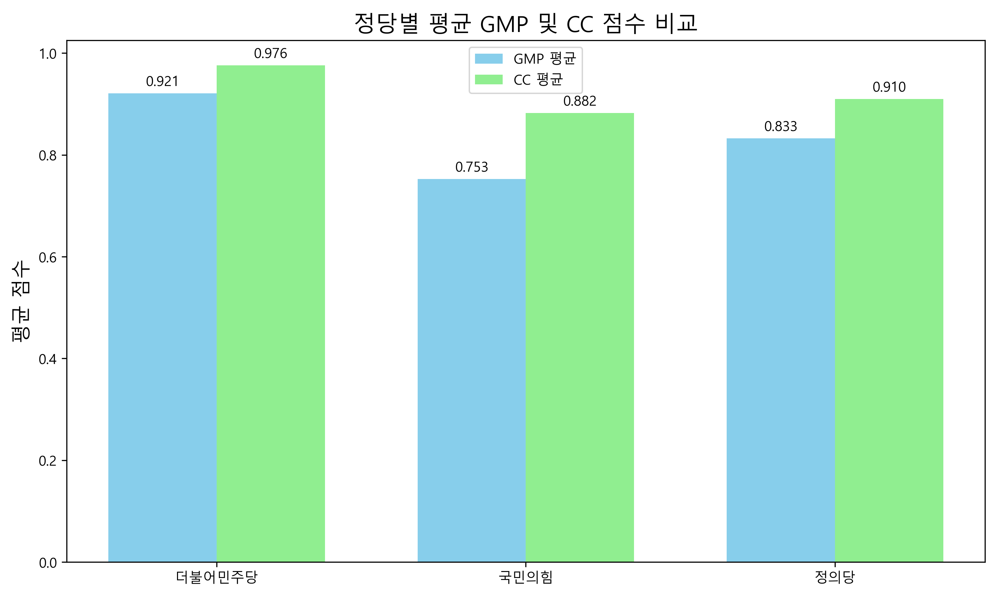

# 21대 국회 표결 데이터 분석 및 W-NOMINATE 모델링

## 프로젝트 개요

본 프로젝트는 대한민국 21대 국회 의원들의 표결 데이터를 수집하고 분석하여, W-NOMINATE 방법론을 통해 의원들의 이념적 좌표를 추정하는 연구입니다. 이를 통해 한국 정치 지형의 이념적 분포를 객관적으로 시각화하고 분석할 수 있습니다.



## 주요 기능

1. **데이터 수집**
   - 국회 공공 API를 통한 21대 국회 의원들의 본회의 표결 정보 수집
   - 법률안 처리 결과 데이터 수집 및 전처리

2. **W-NOMINATE 분석**
   - 의원들의 표결 패턴을 바탕으로 2차원 이념 공간에서의 좌표 추정
   - 진보-보수 스펙트럼 상의 의원 및 정당 위치 분석
   - 주요 정당별 의원들의 이념적 응집도 및 분포 분석

3. **데이터 시각화**
   - 의원들의 이념적 좌표를 2차원 공간에 시각화
   - 정당별 이념 분포 박스플롯 생성
   - 정당별 예측 정확도 및 성능 지표 비교 그래프 제공

## 데이터 소스

- [국회의원 본회의 표결정보, 본회의 처리안건 법률안](https://open.assembly.go.kr/portal/data/service/selectAPIServicePage.do/OPR1MQ000998LC12535)

## 폴더 구조

```
21kr-assembly-w-nominate/
├── src/
│   ├── data_collection/        - 데이터 수집 및 필터
│   ├── analysis/               - 분석 스크립트
│   ├── data/                   - 데이터 저장소
        └── analysis/           - 분석 결과 데이터
```

## 주요 분석 결과

1. **이념적 분포**
   - 21대 국회의 이념적 분포는 주로 1차원(진보-보수)에 의해 설명됨
   - 더불어민주당 의원들은 주로 진보(음수) 영역에, 국민의힘 의원들은 주로 보수(양수) 영역에 위치

2. **모델 성능**
   - 1차원 모델만으로도 93.77%의 높은 표결 예측 정확도 달성
   - 2차원 모델은 94.06%의 정확도로 소폭 향상

3. **정당별 분석**
   - 정당 내 결속력과 이념적 분포를 시각화 및 수치화
   - 정당별 기하평균(GMP)과 분류성공비율(CC) 비교 분석
   
   

## 기술 스택

- **R**: W-NOMINATE 모델 실행 및 데이터 전처리
  - 주요 패키지: wnominate, pscl, reshape2
- **Python**: 데이터 수집, 처리 및 시각화
  - 주요 라이브러리: pandas, matplotlib, numpy

## 시작하기

### 요구사항

- R (>= 4.0.0)
- Python (>= 3.8)
- R 패키지: wnominate, pscl, reshape2
- Python 라이브러리: pandas, matplotlib, numpy

### 실행

1. R 패키지 설치
   ```r
   install.packages(c("wnominate", "pscl", "reshape2"))
   ```

2. Python 라이브러리 설치
   ```bash
   pip install pandas matplotlib numpy
   ```

3. 데이터 준비 및 모델 실행
   ```bash
   Rscript src/analysis/prepare_wnominate_data.R
   Rscript src/analysis/run_wnominate.R
   python src/analysis/visualize_wnominate.py
   ```